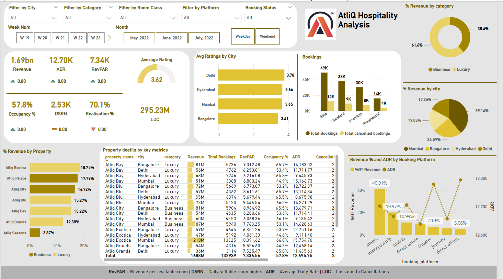

# AtliQ Hospitality Analysis Dashboard- PowerBI

## Project Overview

This project was created as part of the [Codebasics Resume Project Challenge](https://codebasics.io/challenge/codebasics-resume-project-challenge). The goal of this project was to help **Atliq Grands**, a luxury hotel chain in India, regain its market share and revenue by incorporating **Business and Data Intelligence**. 

The management of Atliq Grands lacked in-house data analytics capabilities, so the task was to use their historical data to generate insights and present them via an interactive dashboard. This dashboard would serve as a foundation for more informed decision-making.

## Problem Statement

Atliq Grands has been in the hospitality business for over 20 years but has been losing market share and revenue in the luxury/business hotels category due to increased competition and ineffective management decisions. The **Revenue Management Team** hired external data analysts to provide insights into their performance and guide future strategy.

## Task List

1. **Create Metrics:** Develop key metrics as outlined by the stakeholders.
2. **Design Dashboard:** Build an interactive dashboard to visualize data based on the provided mock-up.
3. **Generate Insights:** Provide relevant data insights beyond the metrics specified in the mock-up.

## Key Insights from the Analysis

- **Mumbai** is the most profitable city with **660.64 million** in revenue, followed by **Bangalore**, **Hyderabad**, and **Delhi**. As a proportion of overall revenue, Mumbai accounts for approximately **39%**.
- As far as revenue share goes, **AtliQ Exotica** is the best-performing property with **18.75%** revenue share, **3.62** rating, **58% occupancy**, and **24.4% cancellation rate**.
- At **66%**, **AtliQ Bay** has the greatest occupancy rate.
- With **139.6 million** in income, **Week 24** was the highest.
- In terms of rating and occupancy, **Delhi** is ranked top, followed by **Hyderabad**, **Mumbai**, and **Bangalore**.
- Cancellations cost Atliq over **298 Million** in sales.
- **Rooms of the elite type** receive the most reservations, but they also have the greatest cancellation rates.
- Have added 7 tooltip charts in the pbix file beacuse of which by hovering over the individual key metrics we can see the trend analysis chart

## Tools & Technologies

- **Power BI**: Used for building the dashboard and data visualization.
- **Excel**: Data cleaning and preliminary analysis.

## Conclusion

This project demonstrated the power of business intelligence in helping **Atliq Grands** identify key areas for improvement, understand the impact of cancellations, and gain insights into property performance. The data-driven approach can help Atliq Grands make more informed decisions to regain market share.

## Dashboard Preview

